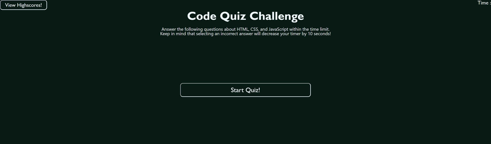

# JN-Code-Quiz

## Description

Through this challenge, I was able to create a quiz using JavaScript. This quiz includes multiple-choice style questions as well as a timer. This challenge was completed by following these acceptance criterias:

```
GIVEN I am taking a code quiz
WHEN I click the start button
THEN a timer starts and I am presented with a question
WHEN I answer a question
THEN I am presented with another question
WHEN I answer a question incorrectly
THEN time is subtracted from the clock
WHEN all questions are answered or the timer reaches 0
THEN the game is over
WHEN the game is over
THEN I can save my initials and my score
```

This challenge has helped me solidify my skills in using web API's as well as strengthened my JavaScipt knowledge. This was the most challenging project to date, but it has helped me learn the most. I faced many challenges such as local storage and timer issues, but with the knowledge provided from class as well as documentations, I was able to complete the assignment. 

This quiz was accomplished by setting up an initial HTML page and adding some components to it. Then the CSS was added to style everything on the page, such as the buttons. The JavaScript page was added last to add functionality to the page.

## Usage

There was no starter code provided for this project. All of the HTML, CSS, and JavaScript files were created from scratch. The image below shows the final product:



## Credits

Thank you Corey Yates and Michael Hodges for all your help! 😊👍

## Links

https://github.com/jkimys2/JN-Code-Quiz

https://jkimys2.github.io/JN-Code-Quiz/